# SkillNest Quiz App

## 📚 Project Overview
SkillNest is a full‑stack quiz platform that lets users sign up, log in, and take category‑based quizzes.  All data (categories, questions, answers, results) is stored in a MySQL database and secured with JWT authentication.

## ✨ Features
- **Quiz categories** (Aptitude, Technical, Programming Basics, SQL & DBMS, DSA)
- **JWT‑based authentication** (login, signup, token refresh)
- **MySQL backend** – persistent storage for quiz data
- **React UI** – responsive, protected routes, intuitive navigation
- **Django REST Framework** API
- **Seed command** to populate the database with 10 questions per category

## 🛠️ Tech Stack
| Layer | Technology |
|------|-----------|
| Frontend | React 19, React Router, Axios |
| Backend | Django 6, Django REST Framework, Simple JWT |
| Database | MySQL 8 |
| Dev tools | npm, pip, python‑dotenv |
## 🖼️ UI Screenshots

### Login Page
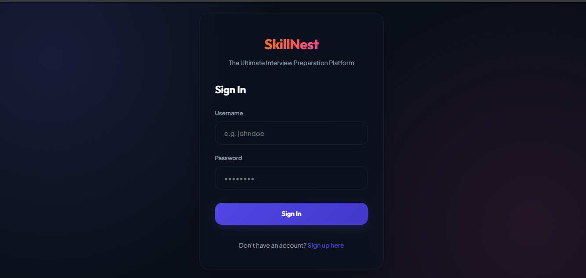

### Signup Page
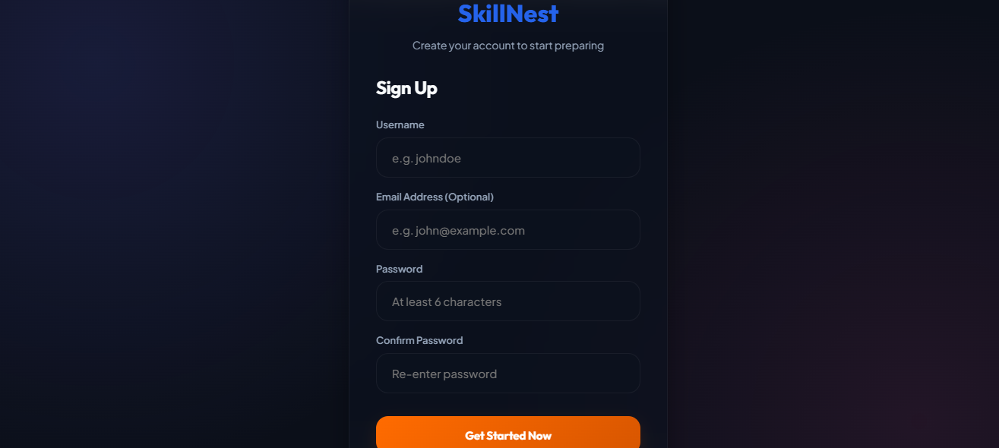

### Dashboard
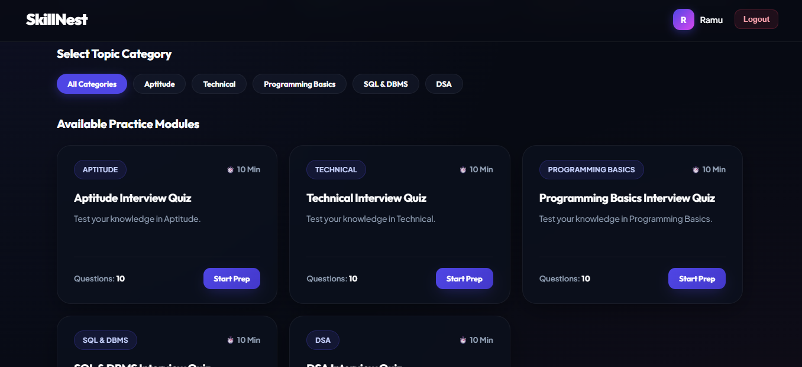

### Dashboard 2
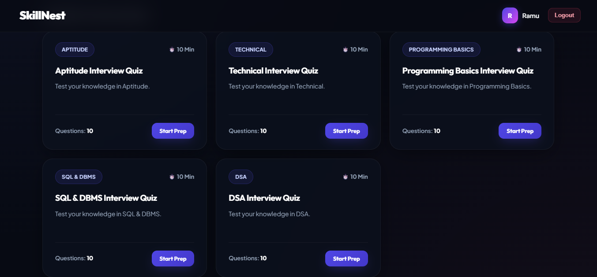

### Test Page
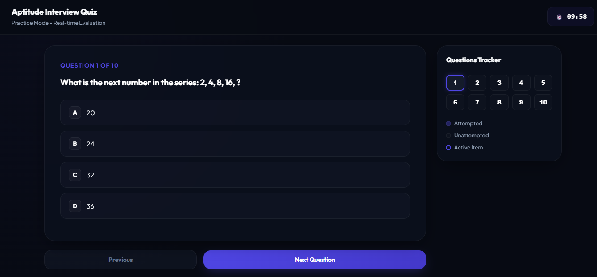

### Result Page
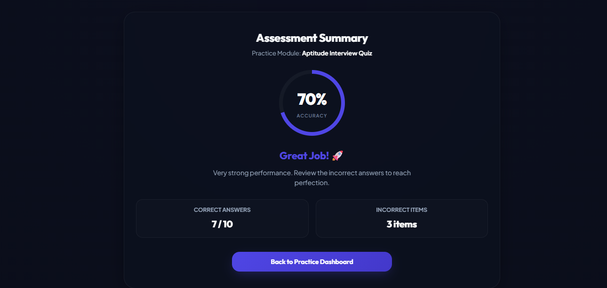

### Review 
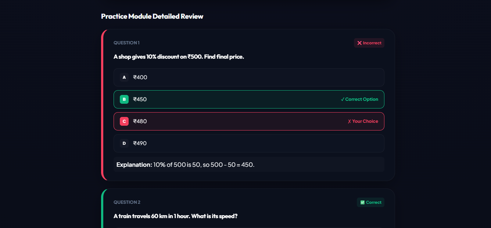

### Score 
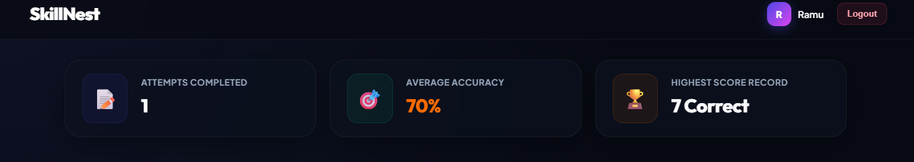

### Performance 
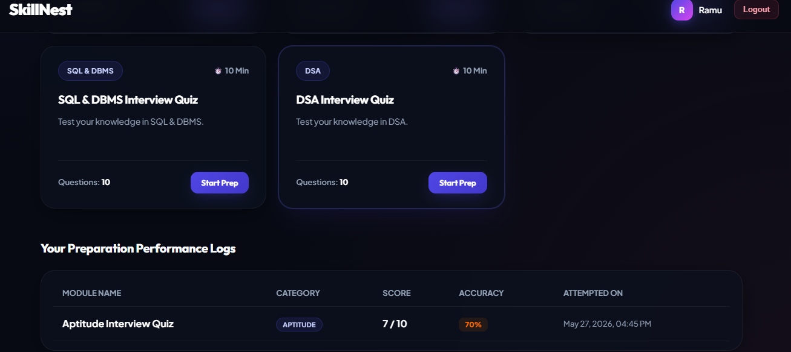

### Admin Login
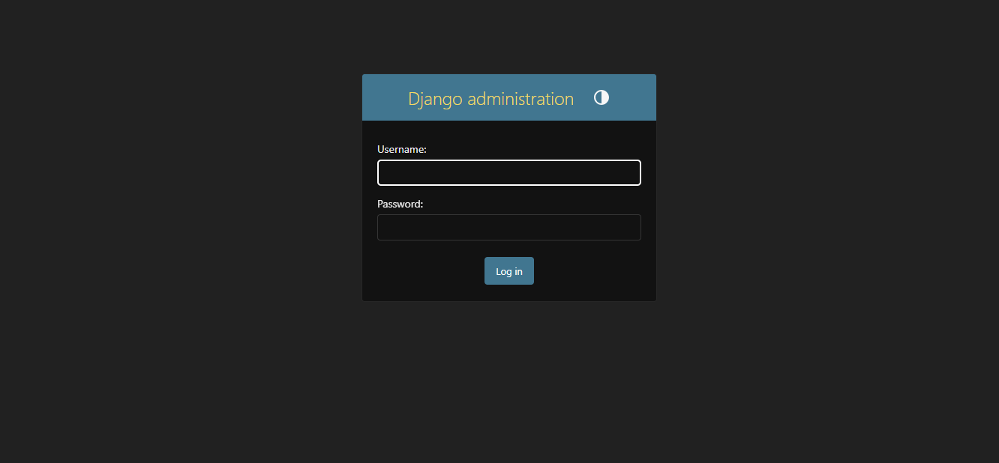

### Admin Dashboard
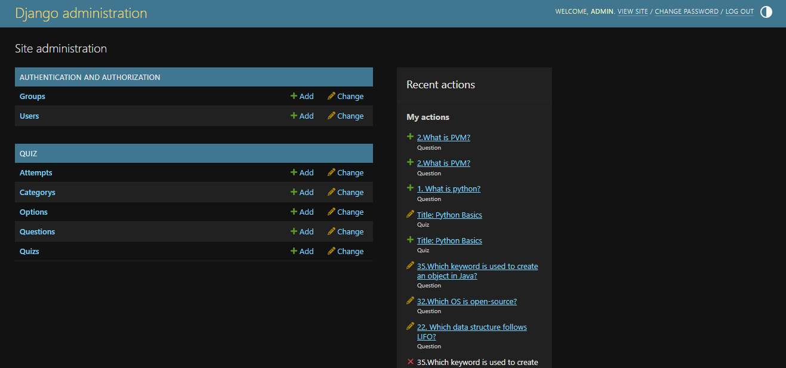

## 🚀 Setup Instructions
### Backend
1. **Clone the repo** and navigate to the project root.
2. **Create a virtual environment**
   ```bash
   python -m venv venv
   .\venv\Scripts\activate   # Windows
   ```
3. **Install Python dependencies**
   ```bash
   pip install -r requirements.txt
   ```
4. **Create a `.env` file** (see below).
5. **Run migrations**
   ```bash
   python manage.py migrate
   ```
6. **Seed the database**
   ```bash
   python manage.py seed_questions
   ```

### Frontend
1. Open a new terminal and `cd` into `quizfrontend`.
2. Install Node dependencies
   ```bash
   npm install
   ```
3. Start the React dev server
   ```bash
   npm start
   ```
   It will be available at `http://localhost:3000`.

## 🌱 Environment Variables (`.env`)
```
DB_NAME=quizdb
DB_USER=root
DB_PASSWORD=your_mysql_password
DB_HOST=localhost
DB_PORT=3306
SECRET_KEY=your_django_secret_key
``` 
Place this file in the project root.  Django reads it via `python-dotenv`.

## 🗄️ MySQL Setup
```sql
CREATE DATABASE quizdb;
CREATE USER 'root'@'localhost' IDENTIFIED BY 'your_mysql_password';
GRANT ALL PRIVILEGES ON quizdb.* TO 'root'@'localhost';
FLUSH PRIVILEGES;
``` 
Make sure MySQL is running and the credentials match the `.env` file.

## 📋 API Endpoints Overview
| Method | Endpoint | Description |
|--------|----------|-------------|
| POST | `/api/token/` | Obtain access & refresh JWT tokens |
| POST | `/api/token/refresh/` | Refresh access token |
| GET | `/api/categories/` | List quiz categories |
| GET | `/api/quizzes/<category>/` | Get quiz for a category |
| POST | `/api/answers/` | Submit answers, receive score |
| GET | `/api/quiz/<id>/questions/` | Retrieve questions for a quiz |

## 📂 Folder Structure
```
Quiz-App/            
├─ manage.py           # Django CLI
├─ requirements.txt   # Python deps
├─ quizbackend/       # Django project
│   ├─ settings.py
│   ├─ urls.py
│   └─ quiz/          # app with models & commands
│       └─ management/commands/seed_questions.py
├─ quizfrontend/       # React app
│   ├─ src/
│   │   ├─ pages/    # Dashboard, Login, Signup, Quiz, Result
│   │   └─ App.js
│   ├─ package.json
│         
└─ README.md          # Project documentation (this file)
```

## 📦 Deployment (Render / Vercel)
### Backend (Render)
1. Create a new **Python** service on Render.
2. Set the *Build Command* to `pip install -r requirements.txt`.
3. Set the *Start Command* to `gunicorn quizbackend.wsgi`.
4. Add the same environment variables from `.env` in Render's dashboard.
5. Ensure the Render MySQL add‑on is attached and update `.env` with its credentials.

### Frontend (Vercel)
1. Connect the Git repo to Vercel.
2. Vercel detects the `npm start` script; set the *Build Command* to `npm run build`.
3. Set the *Output Directory* to `build/`.
4. Add a *Environment Variable* `REACT_APP_API_URL` pointing to the Render backend URL.
5. Deploy – Vercel will serve the static build.

## 🐞 Troubleshooting
- **Cannot connect to MySQL**: Verify MySQL service is running, credentials in `.env` are correct, and firewall allows connections.
- **JWT token missing**: Ensure you include the `Authorization: Bearer <token>` header on protected API calls.
- **React still shows Create‑React‑App boilerplate**: Check that `App.js` imports the correct page components and that routing paths match.
- **Missing migrations**: Run `python manage.py makemigrations` then `python manage.py migrate`.
- **Port conflicts**: Django defaults to 8000, React to 3000. Change via `python manage.py runserver <port>` or set `PORT` env var for React.

---
*Happy coding!*
